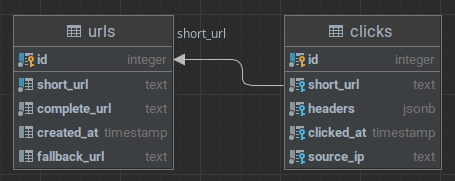

# URL Shortener

This is a simple URL shortener written in Go, it features a Redis cache with a 3-day TTL and a click logger with persistent storage in PostgreSQL

# Running

## Shell
Create a `.env` file with the necessary values (with can be found in the example), and execute the `run.sh`

## Docker

Using docker-compose, run the following
```bash
docker-compose -f docker-compose.yml -f docker-compose.run.yml up -d
```

# SQL Structure

